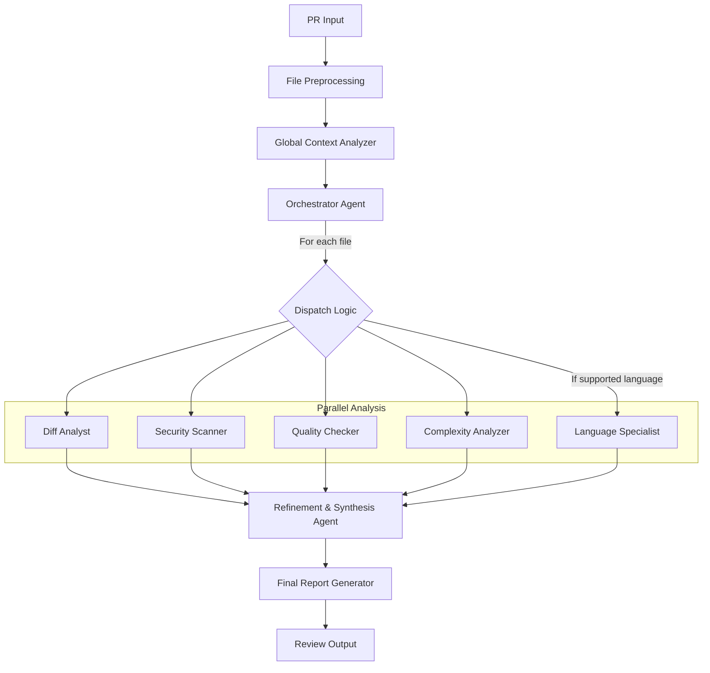

# 通用MultiAgent代码审查系统设计方案

## 概述

本文档详细描述了将现有代码审查系统重构为通用MultiAgent架构的完整方案。该系统将支持多种编程语言，采用专业化Agent分工协作的模式，提供更加全面、准确和可靠的代码审查服务。

## 1. 项目背景与目标

### 1.1 现状问题
- **语言局限性**: 当前系统主要针对JavaScript/TypeScript，不支持其他编程语言
- **审查孤立性**: 文件级别审查和整体审查相互独立，缺乏协作和关联分析
- **缺乏专业化**: 单一Agent处理所有类型的问题，专业深度不足
- **可扩展性差**: 难以添加新的语言支持或分析维度

### 1.2 设计目标
- **语言无关性**: 支持所有主流编程语言的代码审查
- **专业化分工**: 不同类型的问题由专门的Agent处理
- **协作增强**: Agent之间能够共享信息和协作分析
- **质量保证**: 通过多重验证确保审查结果的准确性和可靠性
- **可扩展性**: 易于添加新的语言支持和分析能力

## 2. 架构设计

### 2.1 整体架构



### 2.2 Agent分类

#### 2.2.1 编排与调度Agent
- **OrchestratorAgent**: 流程编排与任务分发的核心，负责初步分析（如语言检测），并根据文件特性和变更内容，智能地决定调用哪些分析Agent。
- **GlobalContextAnalyzer**: 在编排前运行，负责识别跨文件依赖。它会构建一个依赖关系图，其分析结果将注入全局状态，供 `OrchestratorAgent` 和其他Agent使用。

#### 2.2.1.1 智能调度策略

`OrchestratorAgent` 的核心职责之一是根据多种因素动态决定为每个文件分派哪些分析Agent，以实现资源利用和分析深度的最佳平衡。

-   **决策因素**:
    -   **文件类型**: 例如，`package.json` 会触发依赖分析，而 `Dockerfile` 会触发安全配置扫描。
    -   **变更大小**: 微小变更（如修复拼写）可能仅需 `DiffAnalyst`，而大型重构则需要所有相关Agent的全面分析。
    -   **代码复杂度**: 通过初步评估（如圈复杂度）识别出的高复杂度文件，将分配给 `ComplexityAnalyzer` 和 `QualityChecker` 进行重点审查。
    -   **历史数据**: 分析文件的历史变更频率和缺陷密度，高风险文件将接受更严格的审查。
    -   **用户配置**: 允许用户通过特定注释（如 `@review:skip-security`）自定义Agent的执行策略。

-   **动态调度策略**:
    -   **基于规则的优先级**: 定义一套规则，例如“对于所有Go文件，必须执行 `LanguageSpecialist` 和 `SecurityScanner`”。
    -   **基于成本的决策**: 为每个Agent的执行分配一个预估成本（Token消耗和时间），并根据PR的总变更大小和设定的预算，优化选择Agent组合。
    -   **机器学习模型 (未来方向)**: 训练一个简单的分类模型，根据上述决策因素预测最有效的Agent组合。

#### 2.2.2 并行分析Agent
- **通用分析Agent (语言无关)**
  - **DiffAnalyst**: 差异分析专家，专注于变更内容的分析。
  - **SecurityScanner**: 安全扫描专家，基于模式匹配和AST（如果可用）检测安全问题。
  - **QualityChecker**: 质量检查专家，检查代码质量和最佳实践。
  - **ComplexityAnalyzer**: 复杂度分析专家，评估代码复杂度和可维护性。
- **语言特定Agent (按需加载)**
  - **LanguageSpecialist**: 语言专家，负责提供深度的、特定于语言的分析，例如生成AST、检查语言惯例和特定框架的最佳实践。

#### 2.2.3 整合与生成Agent
- **Refinement & Synthesis Agent**: 结果精炼与综合器，负责汇总所有并行分析Agent的输出，进行去重、合并、交叉验证和优先级排序，形成一个结构化的、一致的分析结果。
- **Final Report Generator**: 最终报告生成器，接收来自动`Refinement & Synthesis Agent`的结构化数据，并将其格式化为最终面向用户的审查报告和评论。

### 2.3 状态管理

采用中央状态管理模式，所有Agent共享全局状态：

```typescript
interface GlobalReviewState {
  // 原始输入
  prContext: PRContext;

  // 文件分析数据
  fileAnalysis: Record<string, FileAnalysisData>;

  // Agent执行状态
  agentStates: Record<string, AgentState>;

  // 中间结果
  intermediateResults: IntermediateResults;

  // 最终结果
  finalResult?: ComprehensiveReviewResult;
}
```

## 3. 关键技术特性

### 3.1 多层次分析策略

#### Layer 1: 通用分析 (所有语言适用)
- 基于Diff的变更分析
- 基于正则表达式的模式匹配
- 文件结构和复杂度分析
- 通用安全漏洞检测

#### Layer 2: 语言特定分析 (支持的语言)
- AST (抽象语法树) 解析
- 语言特定的最佳实践检查
- 依赖关系分析
- 类型系统相关检查

#### Layer 3: 生态系统分析 (特定技术栈)
- 框架特定的模式分析
- 配置文件关联分析
- 构建工具集成检查

### 3.2 智能上下文收集

#### 3.2.1 动态策略选择
根据文件重要性和变更复杂度，智能选择上下文收集策略：

- **Comprehensive**: 重要文件，收集完整上下文
- **Standard**: 一般文件，收集基本上下文
- **Minimal**: 简单文件，最小化上下文

#### 3.2.2 全局上下文与关联分析

系统不仅限于单个文件的分析，还具备理解跨文件变更影响的能力。

-   **分析阶段**: 在 `OrchestratorAgent` 调度之前，由 `GlobalContextAnalyzer` 执行全局分析。
-   **依赖识别**: 识别直接依赖、反向依赖、接口与实现关系，并分析构建配置文件。
-   **影响分析**: `OrchestratorAgent` 会利用 `GlobalContextAnalyzer` 生成的“影响集”，将间接受影响的文件也纳入审查范围。

### 3.3 质量保证机制

#### 3.3.1 置信度评分
每个Agent的输出都包含置信度评分，用于结果的加权处理。

#### 3.3.2 多重验证
- **一致性验证**: 检查Agent输出与原始diff的一致性
- **交叉验证**: 检查不同Agent之间的结果一致性
- **合理性验证**: 检查评分和严重性等级的合理性

#### 3.3.3 不确定性标识
明确标识置信度较低的分析结果，提醒需要人工审核。

## 4. 技术实现要点

### 4.1 框架选择

采用TypeScript自建轻量级Agent框架，具备以下特性：
- 与现有代码库无缝集成
- 借鉴LangGraph的工作流设计模式
- 内置状态管理和错误处理
- 支持并行执行和条件分支

### 4.2 Agent接口设计

```typescript
abstract class BaseAgent {
  abstract type: AgentType;
  abstract description: string;

  abstract async process(
    input: any,
    state: GlobalReviewState
  ): Promise<AgentResult>;

  async healthCheck(): Promise<HealthStatus>;
}
```

### 4.3 工作流执行

基于状态图的工作流执行引擎：
- 支持节点并行执行
- 条件分支和动态路由
- 错误处理和恢复机制
- 执行状态监控

## 5. 扩展性设计

### 5.1 语言支持扩展

添加新语言支持只需：
1. 创建对应的LanguageSpecialist子类
2. 实现语言特定的分析逻辑
3. 在语言检测器中注册新语言

### 5.2 规则扩展

安全和质量检查规则支持：
- 配置文件定义
- 热更新机制
- 自定义规则添加
- 规则优先级管理

### 5.3 Agent扩展

支持插件化Agent扩展：
- 标准Agent接口
- 动态加载机制
- 依赖注入支持
- 生命周期管理

## 6. 配置管理

### 6.1 多层级配置

```typescript
interface MultiAgentConfig {
  // 框架配置
  framework: FrameworkConfig;

  // Agent配置
  agents: AgentConfigs;

  // 输出配置
  output: OutputConfig;

  // 语言配置
  languages: LanguageConfigs;
}
```

### 6.2 配置热更新

支持运行时配置更新，无需重启服务。

## 7. 监控与运维

### 7.1 性能监控
- Agent执行时间统计
- Token使用量监控
- 内存和CPU使用监控
- 并发执行效率分析

### 7.2 质量监控
- 置信度分布统计
- 错误率和重试统计
- 结果准确性反馈收集
- A/B测试支持

### 7.3 告警机制
- Agent健康状态监控
- 异常情况自动告警
- 性能阈值监控
- 服务可用性监控

## 8. 优势总结

### 8.1 技术优势
- **真正的语言无关性**: 支持所有主流编程语言
- **专业化深度**: 每个Agent专注特定领域，提供更深入的分析
- **高可靠性**: 多重验证机制确保结果准确性
- **高性能**: 并行执行和智能缓存优化性能

### 8.2 业务优势
- **用户体验**: 更全面、准确的代码审查反馈
- **开发效率**: 自动化发现更多类型的问题
- **代码质量**: 提升整体代码库质量
- **安全保障**: 增强安全漏洞检测能力

### 8.3 运维优势
- **可扩展性**: 易于添加新功能和语言支持
- **可维护性**: 模块化设计便于维护和调试
- **可观测性**: 完善的监控和日志系统
- **高可用性**: 容错设计确保服务稳定性

## 9. 错误处理与降级

为确保系统的稳定性和可靠性，设计了多层次的错误处理和降级机制。

### 9.1 单个Agent失败策略
- **安全重试**: 对因网络波动或瞬时API错误导致的失败，系统会自动进行有限次数的重试。
- **超时跳过**: 每个Agent都设置了执行超时阈值。一旦超时，该Agent的执行将被终止，其分析结果将被标记为不确定或缺失。
- **结果降级**: 如果某个非关键Agent失败，系统将在最终报告中明确注明该维度的分析缺失，并提醒用户需要人工关注。

### 9.2 关键Agent保障机制
- **高优先级与阻塞**: 对于 `SecurityScanner` 等关键Agent，其失败可以被配置为高级别告警，甚至在CI/CD流程中起到阻塞合并的作用，直到问题被解决。
- **备用方案 (Fallback)**: 当依赖的外部服务（如特定的AST解析服务）不可用时，关键Agent可以降级到内部实现的、基于正则表达式的简单模式匹配，以提供基础的保障。

## 10. 性能与可伸缩性

系统设计充分考虑了性能和可伸缩性，以应对不同规模的代码审查请求。

### 10.1 资源限制与超时
- **并发控制**: 通过配置限制并行执行的Agent数量，避免对下游API造成过大压力，并有效管理本地计算资源。
- **Agent级超时**: 为每个Agent设置独立的超时时间，防止单个Agent的性能问题影响整个审查流程。
- **Token预算**: 可以为每个PR或单个文件分配Token预算。当预算耗尽时，系统会优先完成核心分析，并可能跳过一些成本较高的辅助性分析。

### 10.2 大型PR处理策略
- **增量分析**: 对于已审查过的PR，当有新的commit推送时，系统能够智能地只分析变更部分，避免重复工作。
- **文件分批 (Batching)**: 对于包含大量文件的PR，系统可以将其分批处理，每批并行执行，从而加快整体处理速度。
- **摘要优先 (Summary-First)**: 针对包含巨大变更（例如数千行修改）的文件，系统可以采用摘要优先策略，首先快速生成一个高层次的变更摘要，然后再异步地、更深入地执行完整的逐行分析。

---

*本文档版本: v1.1*
*创建日期: 2025-01-09*
*最后更新: 2025-10-09*
