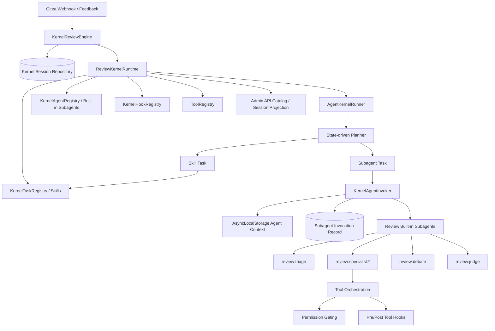
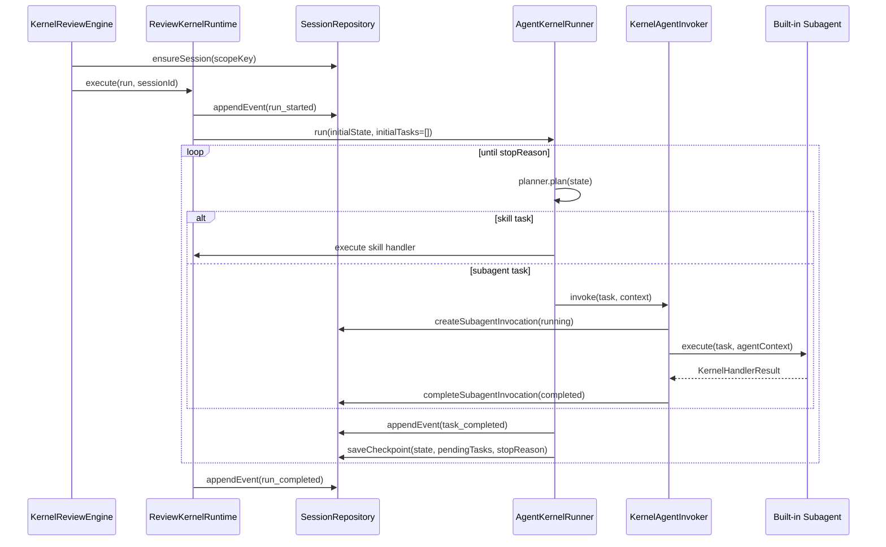
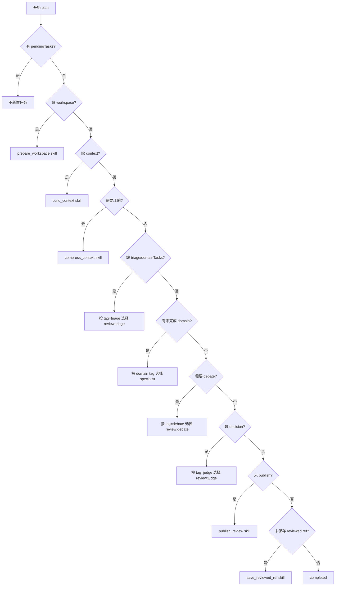
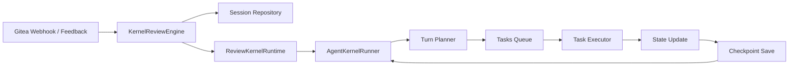
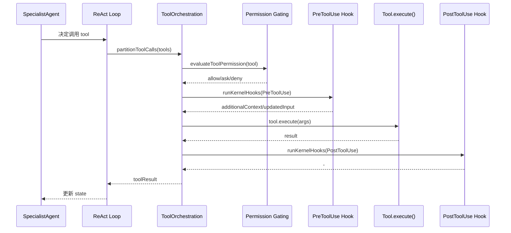
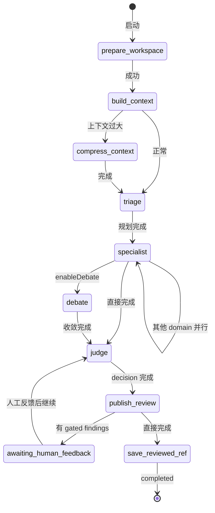
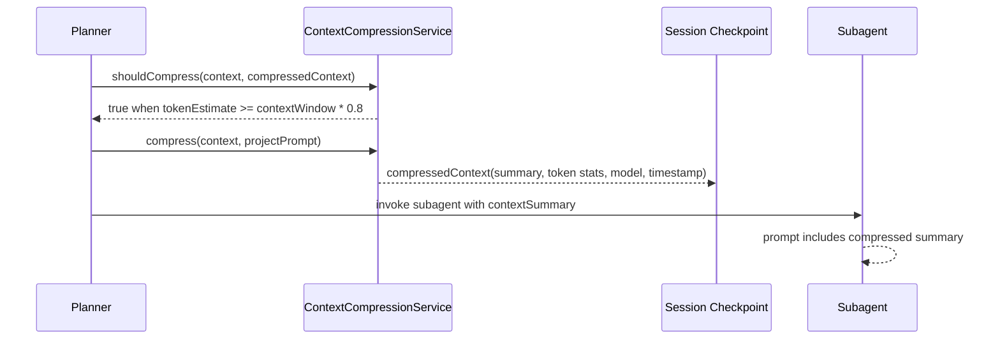

# 技术设计文档：Kernel 内置 Agent 架构

> **状态**: Draft  
> **作者**: AI Architect  
> **日期**: 2026-04-28  
> **相关模块**: `src/agent-kernel/`、`src/review/kernel/`  
> **适用范围**: Review Kernel 的内置 subagent 体系、运行时委派、管理后台可观测能力与生产测试门禁

---

## 目录

- [0. 文档信息](#0-文档信息)
- [1. 背景与目标](#1-背景与目标)
- [2. 设计原则与关键取舍](#2-设计原则与关键取舍)
- [3. 概要设计](#3-概要设计)
- [4. 内置 Agent 详细设计](#4-内置-agent-详细设计)
  - [4.8 Agent工作机制详解](#48-agent工作机制详解)
- [5. 运行时与状态设计](#5-运行时与状态设计)
- [6. API 与管理后台可观测性](#6-api-与管理后台可观测性)
- [7. 非功能性设计](#7-非功能性设计)
- [8. 测试与上线验证](#8-测试与上线验证)
- [9. 风险、待确认与后续演进](#9-风险待确认与后续演进)

---

## 0. 文档信息

| 字段 | 内容 |
|---|---|
| 版本 | v0.1 |
| 状态 | 草案 |
| 目标读者 | 研发 / 架构 / QA / 运维 / 管理后台开发 |
| 系统类型 | AI 应用工程 / 后端 Agent Runtime / 审查系统适配层 |
| 主要代码路径 | `src/agent-kernel/`、`src/review/kernel/` |
| 相关配置 | `REVIEW_ENGINE=kernel` |

### Assumptions

- 当前项目已选择 **kernel-first** 作为代码审查主路径；旧固定 agent 编排不作为未来运行时主路径。
- 内置 Agent 当前以 **built-in subagent definition** 的方式注册，后续可演进到 plugin/custom subagent 加载。
- 一条 PR 对应一个 kernel session，commit 更新、人工反馈和后续恢复都写入同一 session。

### To Be Confirmed

- 是否需要把 built-in subagent 的定义从 TypeScript 代码进一步外置为 YAML/JSON/插件目录。
- 管理后台是否需要支持逐 subagent 的启用/禁用、版本选择与灰度策略。
- `judge` 是否继续保持本地规则主导，还是未来切换为 LLM judge subagent。

---

## 1. 背景与目标

### 1.1 背景

早期审查系统采用固定流程编排：triage、specialist、debate、judge 等角色由运行时代码直接实例化和调用。该方案的问题是：

- 流程扩展需要修改 orchestrator/runtime 代码；
- 角色能力与执行链路耦合，难以按能力标签选择代理；
- 缺少独立 subagent identity、delegation boundary 和 invocation trace；
- 管理后台难以展示“有哪些 Agent、何时被调用、产生了什么结果”；
- 恢复、压缩、权限、hook 等横切能力难以统一接入。

新的 Kernel 内置 Agent 架构将 review 角色转换为注册式 built-in subagents，由 `AgentKernelRunner` 根据 planner 输出与 session state 推进任务，并通过 `KernelAgentInvoker` 统一委派执行。

### 1.2 核心目标

| 目标 | 说明 |
|---|---|
| 注册式扩展 | 内置 Agent 以 `KernelSubagentDefinition` 注册，runtime 不硬编码角色实例 |
| 能力选择 | planner 通过 tags/capabilities 选择 subagent，而不是写死 agent id |
| 可恢复执行 | session checkpoint 持久化 state + pendingTasks，支持 feedback 后继续执行 |
| 委派边界 | 每次 subagent 调用都有 agentId、delegation packet、invocation record、structured result |
| 上下文压缩 | 大上下文触发 compression，summary 写入 checkpoint 并回注后续 subagent |
| 工具治理 | 工具调用走统一 orchestration、permission gating 与 hooks |
| 可观测性 | 管理 API 暴露 task/subagent/hook catalog、session timeline、subagent invocations |

### 1.3 范围与非范围

**范围内**：

- Review Kernel 内置 subagents 的定义、职责、标签、运行链路；
- Kernel agent registry / invoker / runner 与 session checkpoint 的协作；
- 内置 Agent 与 tools、hooks、permission、compression 的集成方式；
- 管理后台需要消费的 catalog 与 session 投影视图；
- 生产前自动化测试门禁。

**范围外**：

- 前端 UI 视觉设计细节；
- 旧 `agent` 固定编排引擎兼容；
- Codex CLI 引擎内部实现；
- 通用插件市场、远程 agent 执行后端和多租户权限模型。

---

## 2. 设计原则与关键取舍

### 2.1 核心设计原则

| 原则 | 落地方式 |
|---|---|
| 高内聚低耦合 | `src/agent-kernel/` 只提供通用 session/runner/registry/invoker/hooks；review 逻辑放在 `src/review/kernel/` |
| 开闭原则 | 新增流程能力优先增加 subagent、skill、hook 或 tool，而不是修改主循环 |
| Session 为状态源 | PR/commit session 记录 event、checkpoint、subagent invocation，是恢复与投影的事实来源 |
| 可观测优先 | 每次 subagent 调用持久化 invocation；每个 task 写入 started/completed/failed event |
| 安全默认 | 工具执行统一经过 permission gating；高风险 scope 默认 ask/deny |
| 可测试 | 断言面落在 checkpoint、events、invocations、tool result、admin projection，而不是完整 LLM 文本 |

### 2.2 关键取舍

| 取舍点 | 选择 | 原因 |
|---|---|---|
| 内置 Agent 表达方式 | TypeScript built-in definitions | 当前阶段需要强类型、低迁移成本；后续可迁移到 plugin loader |
| Agent 调用入口 | `KernelAgentInvoker` 统一调用 | 统一 agentId、hook、invocation persistence、structured result |
| 流程推进方式 | planner + session state | 避免静态任务数组；支持继续执行与人审恢复 |
| Judge 实现 | 规则聚合 + publish policy | 当前 judge 主要做 finding 去重、发布策略与 gate，暂不强制 LLM judge |
| 压缩策略 | planner 模型窗口 80% 触发 | 使用 tokenlens context window，预留 20% 冗余 |
| 管理接口 | task/subagent/hook catalog + session detail | 让后台可解释当前能力目录与执行轨迹 |

---

## 3. 概要设计

### 3.1 总体架构



### 3.2 模块职责

| 模块 | 文件 | 职责 |
|---|---|---|
| Kernel types | `src/agent-kernel/types.ts` | 定义 task、subagent、delegation packet、checkpoint、invocation result |
| Agent registry | `src/agent-kernel/agents/kernel-agent-registry.ts` | 注册、查询、按 tag 过滤 subagent |
| Agent invoker | `src/agent-kernel/agents/kernel-agent-invoker.ts` | 创建 agentId、触发 hook、持久化 invocation、执行 subagent |
| Agent context | `src/agent-kernel/agents/kernel-agent-context.ts` | 使用 AsyncLocalStorage 隔离子代理执行上下文 |
| Runner | `src/agent-kernel/runtime/agent-kernel-runner.ts` | 按 planner 结果推进 skill/subagent task，写 checkpoint 与 task event |
| Session repo | `src/agent-kernel/session/session-repository.ts` | 持久化 session、events、checkpoint、subagent invocations |
| Review runtime | `src/review/kernel/review-kernel-runtime.ts` | 注册 skills/hooks/built-in subagents，提供 execute/continueExecution |
| Built-in subagents | `src/review/kernel/review-built-in-subagents.ts` | 将 triage/specialist/debate/judge 转换为注册式 subagent definitions |
| Subagent ids | `src/review/kernel/review-subagent-ids.ts` | 统一内置 subagent id 命名 |
| Admin projection | `src/review/kernel/session-read-model.ts` | 将 session event/checkpoint/invocation 投影为后台视图 |

### 3.3 核心执行链路



---

## 4. 内置 Agent 详细设计

### 4.1 内置 Agent 目录

| Subagent ID | Source | Model Role | Tags | 职责 | 触发条件 |
|---|---|---|---|---|---|
| `review:triage` | `built-in` | `planner` | `review`, `planner`, `triage` | 根据 diff、文件、风险规划审查域和模式 | build context 完成且尚无 triage/domainTasks |
| `review:specialist:correctness` | `built-in` | `specialist` | `review`, `specialist`, `domain-review`, `domain:correctness` | 检查业务逻辑、边界条件、空值、明显 bug | domainTasks 中存在 correctness 且未完成 |
| `review:specialist:security` | `built-in` | `specialist` | `review`, `specialist`, `domain-review`, `domain:security` | 检查注入、权限绕过、敏感信息、输入校验 | domainTasks 中存在 security 且未完成 |
| `review:specialist:reliability` | `built-in` | `specialist` | `review`, `specialist`, `domain-review`, `domain:reliability` | 检查错误处理、重试、幂等、并发一致性、资源释放 | domainTasks 中存在 reliability 且未完成 |
| `review:specialist:maintainability` | `built-in` | `specialist` | `review`, `specialist`, `domain-review`, `domain:maintainability` | 检查可维护性、复杂度、接口风险、可测试性 | domainTasks 中存在 maintainability 且未完成 |
| `review:debate` | `built-in` | `specialist` | `review`, `debate` | 对高风险 findings 做交叉辩论与收敛 | `enableDebate=true` 且存在可辩论 findings |
| `review:judge` | `built-in` | `judge` | `review`, `judge` | 聚合 findings，应用 publish policy，写入 store | 所有 domain review/debate 完成且尚无 decision |

### 4.2 Subagent Definition 契约

每个内置 Agent 必须实现 `KernelSubagentDefinition<TState>`：

```typescript
interface KernelSubagentDefinition<TState> {
  kind: 'subagent';
  name: string;
  source: 'built-in' | 'custom' | 'plugin';
  description: string;
  whenToUse: string;
  tags?: string[];
  modelRole?: string;
  resumable?: boolean;
  execute(task, context): Promise<KernelHandlerResult<TState> | undefined>;
}
```

关键约束：

- `name` 必须稳定，作为 session event、invocation、admin catalog 的统一标识；
- `tags` 必须包含能力标签，planner 只能按 tag/capability 选择代理；
- `whenToUse` 既用于管理后台解释，也用于 delegation packet 的 goal；
- `execute` 不直接控制主循环，只返回 state/enqueue/prepend/stopReason；
- 内置 Agent 不应越权直接修改 pendingTasks，除非通过标准 `KernelHandlerResult`。

### 4.3 Planner 选择规则

`ReviewKernelRuntime.planTasks()` 根据 checkpoint state 推导下一步：



### 4.4 Triage Agent

`review:triage` 包装 `TriageAgent`，输出 `domainTasks`：

- 使用 `planner` 模型角色；
- 接收 `projectPrompt` 和 `compressedContext.summary`；
- 当 triage 禁用或结果为空时，生成默认四域任务：correctness/security/reliability/maintainability；
- 对重复 domain 任务做合并，合并 paths/riskTags/tokenBudget/maxIterations/allowTools 等配置。

### 4.5 Specialist Agents

四类 specialist 均包装 `ReflexionAgent`：

- 共享 `ToolRegistry`、`LearningSystem`、`KernelHookRegistry`；
- 根据 `ReviewTask` 控制 scopePaths、allowTools、maxIterations、mode、tokenBudget；
- 支持压缩 summary 回注到 prompt；
- 在非 trivial/full 场景下可使用 reflection；
- 工具调用统一经过 tool orchestration、permission gating、Pre/Post tool hooks。

### 4.6 Debate Agent

`review:debate` 包装 `DebateOrchestrator`：

- 仅在 `config.review.enableDebate=true` 且 triage mode 为 `full` 时参与；
- trivial 或无 findings 时直接标记 `debateCompleted=true`；
- 按 `debateThreshold` 选择 high/medium findings；
- 根据 finding category 选择同域 specialist，并可引入 correctness/security 做交叉辩论。

### 4.7 Judge Agent

`review:judge` 包装 `JudgeAgent` 与 `applyPublishPolicy`：

- 聚合所有 findings；
- 根据 `autoPublishMinConfidence` 与 `enableHumanGate` 划分 publishable/gated；
- 将可发布与待人工 gate 的 findings 写入 `FileReviewStore`；
- 保留已有 `published` 状态，避免恢复后重复发布。

---

## 4.8 Agent工作机制详解

本节详细说明 Kernel Agent 的运转机制、任务调度、工具调用、决策逻辑及边界划分。

### 4.8.1 核心运转架构

Kernel 采用「**事件驱动 + 状态机**」的运行模式：



**关键组件职责**:

| 组件 | 文件 | 核心职责 |
|------|------|----------|
| **AgentKernelRunner** | `agent-kernel-runner.ts` | 主循环控制器：任务调度、状态流转、checkpoint 管理 |
| **ReviewKernelRuntime** | `review-kernel-runtime.ts` | Review 业务运行时：封装 skills、subagents、hooks、tools |
| **KernelTurnPlanner** | `review-kernel-runtime.ts:305-361` | 基于当前 state 决定下一步执行什么任务 |

### 4.8.2 核心运转流程

**1. 启动阶段**:
```typescript
// PR webhook 触发
kernelReviewEngine.enqueuePullRequest(payload)
  → ensureSession(scopeKey)           // 创建或复用 session
  → runtime.execute(run, sessionId) // 启动运行时
  → AgentKernelRunner.run({          // 启动主循环
      sessionId,
      initialState: {...},
      initialTasks: []
    })
```

**2. 主循环机制** (`AgentKernelRunner.run`):

```typescript
async run({ sessionId, initialState, initialTasks, continueExisting }) {
  // 从 checkpoint 恢复状态（支持继续执行）
  const persisted = loadCheckpoint(sessionId);
  let state = persisted?.state ?? initialState;
  const pendingTasks = [...(persisted?.pendingTasks ?? initialTasks)];
  
  // 主循环：直到有 stopReason
  while (!stopReason) {
    // 如果没有待执行任务，让 planner 规划新任务
    if (pendingTasks.length === 0) {
      const planned = planner.plan({ session, state, pendingTasks });
      pendingTasks.push(...planned);
    }
    
    // 取出下一个任务
    const task = pendingTasks.shift();
    
    // 执行任务
    const result = await executeTask(task, context);
    
    // 处理执行结果
    if (result?.state) state = result.state;              // 更新状态
    if (result?.prepend) pendingTasks.unshift(...result.prepend);  // 前置任务
    if (result?.enqueue) pendingTasks.push(...result.enqueue);        // 后置任务
    if (result?.stopReason) stopReason = result.stopReason;          // 停止原因
    
    // 保存 checkpoint（支持失败恢复）
    saveCheckpoint(sessionId, { state, pendingTasks, stopReason });
  }
}
```

**3. 恢复机制** (`continueExisting`):
- 从 SQLite 加载持久化的 checkpoint
- 恢复 `state` 和 `pendingTasks`
- **显式忽略**旧 checkpoint 的 `stopReason`，允许从 feedback 后继续
- 不 replay events，直接继续执行

### 4.8.3 任务调度与决策

**Planner 是决策中枢**，根据当前 state 动态决定下一步：

```typescript
private planTasks(context: KernelPlanningContext): KernelTask[] {
  // 阶段1: 前置条件检查（顺序执行）
  if (!context.state.workspacePath) {
    return [{ kind: 'skill', name: 'prepare_workspace' }];
  }
  if (!context.state.context) {
    return [{ kind: 'skill', name: 'build_context' }];
  }
  
  // 阶段2: 上下文压缩决策
  if (shouldCompress(context)) {
    return [{ kind: 'skill', name: 'compress_context' }];
  }
  
  // 阶段3: Triage 决策（规划审查域）
  if (!context.state.triage) {
    return [{ kind: 'subagent', name: 'review:triage' }];
  }
  
  // 阶段4: Specialist 并发派生（按 domain）
  const remainingDomains = getRemainingDomains(context);
  if (remainingDomains.length > 0) {
    return remainingDomains.map(domain => ({
      kind: 'subagent',
      name: `review:specialist:${domain}`  // correctness/security/reliability/maintainability
    }));
  }
  
  // 阶段5: Debate 决策（高风险收敛）
  if (enableDebate && !debateCompleted) {
    return [{ kind: 'subagent', name: 'review:debate' }];
  }
  
  // 阶段6: Judge 决策（聚合发布）
  if (!context.state.decision) {
    return [{ kind: 'subagent', name: 'review:judge' }];
  }
  
  // 阶段7: 发布与收尾
  if (!context.state.published) {
    return [{ kind: 'skill', name: 'publish_review' }];
  }
  
  return []; // 完成
}
```

**决策依据**:
- **当前 State**: `domainTasks`, `completedDomains`, `decision`, `published` 等字段
- **Tags/Capabilities**: 按标签选择 subagent（`filterByTag('triage')`），非硬编码
- **Config 开关**: `enableDebate`, `autoPublishMinConfidence` 等

### 4.8.4 Skills 与 Subagents 调用机制

**Skills - 原子任务**:

```typescript
// 注册 Skills
this.skillRegistry.register(createPrepareWorkspaceSkill());
this.skillRegistry.register(createBuildContextSkill());

// Skill 定义
{
  kind: 'skill',
  name: 'build_context',
  execute: async (task, context) => {
    // 执行业务逻辑
    const reviewContext = await diffExtractor.buildContext(...);
    
    return {
      state: { ...context.state, context: reviewContext },  // 更新状态
      // 可选控制流
      prepend: [],      // 在当前任务前插入新任务
      enqueue: [],      // 在当前任务后追加新任务
      stopReason: undefined  // 或 'completed', 'failed', 'awaiting_human_feedback'
    };
  }
}
```

**Subagents - 委派执行**:

```typescript
// 调用路径
AgentKernelRunner → KernelAgentInvoker.invoke(task, context)
  → 创建 invocation record
  → 执行 subagent.execute(task, agentContext)
  → 完成 invocation，返回结果
```

```typescript
// Subagent 执行上下文
const agentContext: KernelAgentExecutionContext = {
  ...context,
  agent,           // subagent 定义
  delegation: {    // 委派包
    goal: agent.whenToUse,
    parentTaskName: task.name,
    input: task.input,
    contextSummary: state.compressedContext?.summary  // 压缩摘要回注
  }
};

// 执行（带 AsyncLocalStorage 隔离）
const result = await runWithKernelAgentContext(
  { agentId, parentSessionId, agentType: 'subagent', ... },
  () => agent.execute(task, agentContext)
);
```

### 4.8.5 Tools 调用机制

**调用路径**（在 Subagent 内部，如 Specialist）:



**并发控制**:
- **并发安全工具** (`isConcurrencySafe: true`): 并行执行
- **非并发安全工具**: 串行执行
- **权限拦截**: `PermissionRequest` Hook 可批准/阻断

**权限边界**:

| Scope | 默认行为 | 说明 |
|-------|----------|------|
| `read` | `allow` | 安全操作（读文件、搜索代码） |
| `write` | `ask` | 需审批（写文件） |
| `command` | `ask` | 需审批（执行命令） |
| `git_write` | `ask` | 需审批（Git 操作） |
| `network` | `deny` | 禁止网络访问 |
| `cross_session` | `deny` | 禁止跨 session 操作 |

### 4.8.6 代码审查结合流程

**完整数据流**:

```
Webhook → PR/Commit
  ↓
prepare_workspace → 克隆仓库、准备 mirror/workspace
  ↓
build_context → 提取 diff、文件内容、构建 ReviewContext
  ↓
compress_context (可选) → 大上下文自动压缩，生成 summary
  ↓
review:triage → 规划审查域（correctness/security/reliability/maintainability）
  ↓
review:specialist:* (并发) → 各域并发审查，生成 findings
  ↓
review:debate → 高风险 finding 交叉辩论收敛
  ↓
review:judge → 聚合 findings，应用发布策略
  ↓
publish_review → 发布 summary + line comments
  ↓
save_reviewed_ref → 保存审查快照（支持增量审查）
```

**状态流转**:



### 4.8.7 边界划分

**Skills vs Subagents 边界**:

| 维度 | Skills | Subagents |
|------|--------|-----------|
| **粒度** | 原子操作（准备环境、构建上下文、发布） | 复杂推理（规划、审查、辩论、判决） |
| **模型** | 通常不涉及 LLM | 必须调用 LLM（planner/specialist/judge） |
| **并发** | 顺序执行 | 可并发（如 4 个 specialist 同时审查） |
| **状态** | 修改 state 字段 | 可修改 state，主要产出 findings/decision |
| **失败** | 阻断整个流程 | 可单独重试或降级 |
| **示例** | prepare_workspace, publish_review | review:triage, review:specialist:* |

**Runtime vs Runner 边界**:

| 组件 | 职责 | 不做什么 |
|------|------|----------|
| **AgentKernelRunner** | 通用调度、checkpoint、task 循环 | 不感知 Review 业务逻辑 |
| **ReviewKernelRuntime** | Review 业务封装、skills、subagents、hooks | 不直接调度任务（委托给 runner） |

**Subagents 间边界**:

| Subagent | 输入 | 输出 | 边界限制 |
|----------|------|------|----------|
| **triage** | ReviewContext | domainTasks[] | 只规划，不审查 |
| **specialist** | domain task + context | findings[] | 只审查指定域，不跨域 |
| **debate** | findings[] | refined findings | 只在 enableDebate 时触发 |
| **judge** | all findings | decision + policyResult | 只聚合判决，不生成新 findings |

**Hook 介入边界**:

```typescript
// 在关键生命周期点介入
SessionStart       // session 启动时
SubagentStart      // subagent 启动时
PreToolUse         // 工具调用前（可修改输入、阻断）
PermissionRequest  // 权限请求时（决定 allow/ask/deny）
PostToolUse        // 工具调用成功后
PostToolUseFailure // 工具调用失败后
```

**Session 隔离边界**:

- 每个 PR/Commit 对应独立 session
- session 间 state 不共享
- tool 默认禁止 cross_session 操作
- subagent invocation 绑定 parentSessionId

---

## 5. 运行时与状态设计

### 5.1 Session 与 Checkpoint

每条 PR/commit 审查对应一个 kernel session：

| 数据 | 用途 |
|---|---|
| `KernelSessionRecord` | 记录 scopeType、scopeKey、metadata、lastRunId |
| `KernelSessionEventRecord` | append-only 事件流，记录 run/task/hook/feedback 生命周期 |
| `KernelCheckpoint<TState>` | 持久化 state、pendingTasks、stopReason |
| `KernelSubagentInvocationRecord` | 记录每次 subagent 委派调用 |

恢复语义：

- `continueExisting=true` 时从 persisted checkpoint 恢复 `state + pendingTasks`；
- 显式忽略旧 checkpoint 的 stopReason，允许 feedback 后继续推进；
- 当前不 replay session events 重建 state，event 主要用于投影与审计。

### 5.2 ReviewKernelState

核心状态包括：

| 字段 | 说明 |
|---|---|
| `targetSha` | 当前审查目标 commit |
| `mirrorPath/workspacePath` | 本地仓库与工作区路径 |
| `context` | `ReviewContext`，包含 diff、changedFiles、fileContents 等 |
| `projectPrompt` | 仓库级审查 prompt |
| `compressedContext` | 自动压缩摘要及 token 元数据 |
| `triage/domainTasks/completedDomains` | 任务规划与完成域 |
| `findings` | subagents 收集到的问题 |
| `decision/policyResult` | judge 与发布策略结果 |
| `debateCompleted/published/reviewedRefSaved` | 后续阶段状态位 |

### 5.3 Subagent Invocation

每次 subagent 调用会持久化：

| 字段 | 说明 |
|---|---|
| `parent_session_id` | 父 session |
| `parent_run_id` | 当前 review run |
| `parent_task_name` | 触发该调用的 task name |
| `subagent_name` | subagent id，例如 `review:triage` |
| `agent_id` | 本次调用唯一 agent identity |
| `status` | running / completed / failed |
| `input_json` | delegation packet |
| `result_json` | structured invocation result |

失败处理：

- invoker 将 invocation 标记为 `failed`；
- runner 写入 `task_failed` event；
- checkpoint 保存当前 state 与 `[failedTask, ...pendingTasks]`，stopReason=`failed`；
- 调用方可根据 checkpoint 与错误信息决定重试/人工介入。

### 5.4 上下文压缩与回注



压缩触发阈值：

- 使用 `tokenCounter.getContextWindow(plannerModel)` 获取模型上下文窗口；
- 取 80% 作为触发阈值，预留 20% 冗余；
- 若无法获取模型配置，兜底使用默认窗口。

### 5.5 Hooks 与 Permission

内置 hooks：

| Hook | Event | 作用 |
|---|---|---|
| `kernel:session-start-audit` | `SessionStart` | 写入 `hook_session_start` event |
| `kernel:subagent-start-audit` | `SubagentStart` | 写入 `hook_subagent_start` event |
| `kernel:pre-tool-audit` | `PreToolUse` | 为工具调用追加审计上下文 |
| `kernel:permission-request-audit` | `PermissionRequest` | 记录权限请求上下文 |

工具权限默认策略：

| Scope | 默认行为 |
|---|---|
| `read` | allow |
| `write` | ask |
| `command` | ask |
| `git_write` | ask |
| `network` | deny |
| `cross_session` | deny |

---

## 6. API 与管理后台可观测性

### 6.1 Admin API

| API | 说明 |
|---|---|
| `GET /admin/api/review/sessions` | 返回 session 列表与 summary |
| `GET /admin/api/review/sessions/:sessionId` | 返回 session、summary、checkpoint、plan、timeline、events、subagentInvocations、runDetails |
| `GET /admin/api/review/kernel/tasks` | 返回 skill + subagent task catalog |
| `GET /admin/api/review/kernel/subagents` | 返回 subagent catalog |
| `GET /admin/api/review/kernel/hooks` | 返回 hook catalog |

### 6.2 Subagent Catalog 响应字段

```json
{
  "kind": "subagent",
  "name": "review:specialist:correctness",
  "source": "built-in",
  "description": "专项审查 correctness 域变更",
  "whenToUse": "当 triage 或 planner 认为 correctness 是本轮 PR 的重点风险域时",
  "modelRole": "specialist",
  "tags": ["review", "specialist", "domain-review", "domain:correctness"],
  "resumable": true
}
```

### 6.3 管理后台展示建议

管理后台应采用双层控制面：

- 上层：Kernel Subagents 目录，展示 built-in/custom/plugin subagents；
- 下层：模型角色路由，配置 `planner / specialist / judge / embedding` 到 provider/model。

展示字段建议：

| 区域 | 字段 |
|---|---|
| Subagent 目录 | name、source、description、whenToUse、modelRole、tags、resumable |
| Session 详情 | summary、plan、timeline、findings、comments、subagentInvocations |
| Invocation 详情 | agentId、status、startedAt、finishedAt、summary、artifacts |

---

## 7. 非功能性设计

### 7.1 安全设计

- 工具调用统一走 permission gating，避免 subagent 绕过权限策略；
- 高风险工具默认 ask/deny，不允许直接执行网络、跨 session 或写操作；
- hooks 可作为后续审批、审计、通知与策略扩展点；
- LLM prompt 不作为安全边界，所有外部副作用必须由 tool/skill/adapters 承载。

### 7.2 高可用与恢复

- 每个 task 完成后保存 checkpoint，降低失败后的重复工作；
- subagent invocation 失败会记录 failed 状态，便于定位失败代理；
- feedback 后通过 `continueExisting` 从 checkpoint 继续；
- publish 与 save reviewed ref 分离，避免评论发布与 ref 保存互相污染；
- cleanup workspace 放在 runtime finally 中执行，降低资源泄漏风险。

### 7.3 可观测性

- session event 记录 run/task/hook/feedback 生命周期；
- subagent invocation 记录 parent-child 委派关系；
- admin projection 汇总 plan/timeline/currentStep/findingCount/pendingTaskCount；
- compression 记录 sourceTokenEstimate、summaryTokenEstimate、triggerThreshold、model。

### 7.4 性能与容量

- 大 diff 先经 diff extractor/token budget 裁剪，再由 compression service 做会话级摘要；
- specialist 按 domain 分治，降低单次 prompt 复杂度；
- tool orchestration 可并发执行 read-only 工具，非并发安全工具串行；
- session/event/checkpoint 使用 SQLite，适合当前单体部署；未来高并发可迁移到外部数据库。

### 7.5 可维护性与扩展性

- 新增内置 Agent 应只新增 `KernelSubagentDefinition` 并打 tags；
- 新增流程副作用应优先实现 skill/adapters；
- 新增横切逻辑应优先实现 hook；
- 新增工具必须声明 permissionScope 和 isConcurrencySafe。

---

## 8. 测试与上线验证

### 8.1 自动化测试分层

| 层级 | 测试文件 | 覆盖点 |
|---|---|---|
| Unit | `src/review/kernel/__tests__/session-read-model.test.ts` | session summary/plan/timeline 投影 |
| Unit | `src/review/tools/__tests__/tool-permissions.test.ts` | permission scope 默认策略 |
| Contract | `src/agent-kernel/hooks/__tests__/kernel-hook-runner.test.ts` | hook 聚合、approve/block、updatedInput |
| Integration | `src/controllers/__tests__/admin-review-sessions.test.ts` | admin session 与 catalog API |
| Integration | `src/controllers/__tests__/feedback-kernel-session.test.ts` | feedback approve/reject/rollback/continue |
| Runtime | `src/review/kernel/__tests__/runtime-happy-path.test.ts` | 完整 runtime happy path |
| Runtime | `src/review/kernel/__tests__/runtime-feedback-resume.test.ts` | awaiting feedback 后恢复 |
| Runtime | `src/review/kernel/__tests__/runtime-replay-invariants.test.ts` | checkpoint/resume/replay 不变量 |
| Runtime | `src/review/kernel/__tests__/runtime-concurrency-idempotency.test.ts` | 并发上限与幂等 |
| Canary | `src/review/kernel/__tests__/compression-resumability.test.ts` | 压缩恢复与生产关键 canary |

### 8.2 上线前门禁

必须通过：

```bash
bun run lint
bun run build
bun test src/review/kernel/__tests__ src/review/tools/__tests__ src/controllers/__tests__ src/agent-kernel/hooks/__tests__
bun test
```

关键验收信号：

- runtime happy path 完成，stopReason=`completed`；
- feedback resume 从 `awaiting_human_feedback` 恢复到 completed；
- compression resume 保留 targetSha、pending boundary、invocation boundary、summary；
- permission deny 不会绕过工具治理；
- duplicate enqueue/continue/feedback 不产生重复有效工作；
- admin session detail 能看到 plan/timeline/subagentInvocations。

### 8.3 灰度与回滚

- 配置默认：`REVIEW_ENGINE=kernel`；
- 若需要回滚，可临时切到 `codex` 引擎，但旧固定 agent 编排不再作为主路径；
- 灰度期间重点观察 session stopReason 分布、task_failed 事件、subagent failed invocations、feedback resume 成功率。

---

## 9. 风险、待确认与后续演进

### 9.1 风险与应对

| 风险 | 影响 | 应对 |
|---|---|---|
| Built-in definitions 仍在代码中 | 扩展仍需发版 | 下一阶段引入 plugin/custom subagent loader |
| Judge 主要由本地规则驱动 | `judge` modelRole 配置生效有限 | 明确 UI 文案；后续可增加 LLM judge implementation |
| SQLite 单文件并发能力有限 | 高并发 session 下写入竞争 | 当前单体可接受；未来迁移外部 DB 或队列化写入 |
| Compression summary 可能遗漏细节 | 后续 subagent 判断偏差 | 保留 recent context + summary；测试锁定关键事实不丢 |
| Hook 阻断策略过强或过弱 | 工具误阻断或越权 | permission matrix 测试 + 审计 event + 管理后台策略展示 |

### 9.2 后续演进计划

1. **Plugin-based Subagent Loading**：支持从目录或配置加载 custom/plugin subagents。
2. **Child Session Tree**：为长任务或后台 subagent 引入 child session/resume tree。
3. **Attachment Reinjection**：压缩后恢复文件附件、计划附件和技能附件。
4. **更细粒度权限模型**：支持仓库级、工具级、用户级策略配置。
5. **Subagent 版本治理**：为 built-in/custom/plugin subagents 增加 version、enabled、rollout 字段。
6. **LLM Judge 可插拔化**：将当前本地 judge policy 拆成 rule judge 与 LLM judge 两类可选 subagent。

### 9.3 评审清单

- [ ] 内置 Agent 是否都通过 registry/invoker 调用，而不是 runtime 硬编码实例？
- [ ] planner 是否按 tag/capability 选择 subagent？
- [ ] 每次 subagent 调用是否有 invocation record？
- [ ] feedback 后 continue 是否从 checkpoint 恢复？
- [ ] 压缩 summary 是否持久化并回注 triage/specialist？
- [ ] 工具执行是否经过 permission/hook/orchestration？
- [ ] 管理后台是否能展示 catalog、timeline、invocations？
- [ ] 生产测试门禁是否覆盖 happy path、失败恢复、幂等和 canary？

---

## 版本记录

| 版本 | 日期 | 说明 |
|---|---|---|
| v0.1 | 2026-04-28 | 初版：记录 Kernel 内置 Agent 架构、运行链路、可观测性与测试门禁 |
